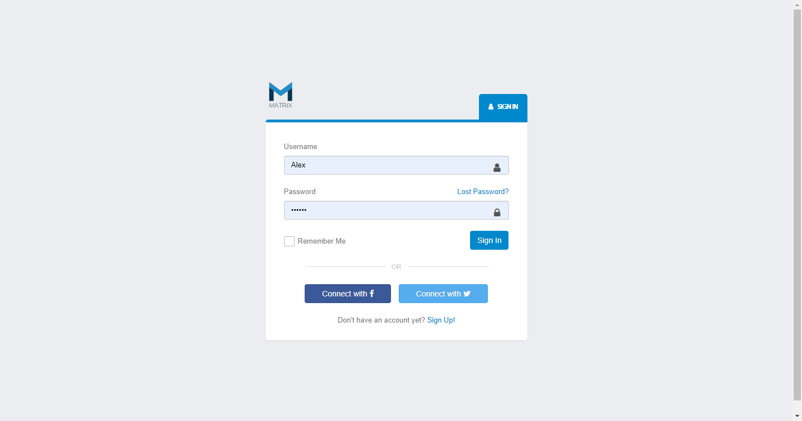

# Matrix 工作室管理系统

## 项目背景

Matrix 工作室是以提供成员在线学习和项目制作为业务的社团，成立于2016年，经过4年的发展，目前成员已过百人。

成员的冗余和管理的松散导致了以下问题：

1. 成员学习效率低

工作室提供给新成员在线学习的资源，但资源混乱，都是以链接的形式发送到QQ群中，不易查找，不利于新成员学习。

2. 成员绩效考核体系不健全

针对成员每次会议情况、成员自学进度、参与项目贡献程度等工作，没有一套完善的绩效考核体系，导致成员学习工作效率低。

3. 成员管理缺乏科学规划

工作室在成员管理方面没有科学规划，只是走一步看一步，始终语出被动局面，使得成员简历管理、信息管理、工作室纳新管理等没有计划性，导致在成员管理上存在较大的随意性。

## 项目概述

#### 程序的开发环境

Python 版本：Python 3.7(MiniConda)
Django 版本：Django 2.2.5
测试浏览器：Chrome

#### 程序的实现的功能

1. 登录

测试账号：
    
    username:Alex
    password:123456

2. 二级菜单

3. 路径导航

4. 添加功能

5. 项目管理

项目分为公共项目和我的项目，类比于客户中的公户和私户

6. 作业管理

作业分为作业列表和我的作业，学员可以通过我的作业提交作业，老师通过作业列表批改作业

7. 权限批量操作

8. 权限分配

9. 菜单分配

#### 程序的启动方式

运行Django程序，待项目启动后通过浏览器访问：http://127.0.0.1:8000/index/home/。
